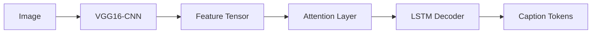

# Visual Caption Generator

## Architecture

## Core Components

### 1. Vision Encoder
**Modified VGG16**:
- Last FC layer replaced with 256D bottleneck  
- Added spatial attention gates  
- Fine-tuned conv5 block  

### 2. Language Decoder
**2-Layer LSTM**:
- 512 hidden units  
- Bahdanau attention  
- Beam search (k=3)  

## Training Specs

| Parameter       | Value               |
|-----------------|---------------------|
| Dataset         | Flickr30k (145K)    |
| Epochs          | 30                  |
| Batch Size      | 64                  |
| Optimizer       | AdamW (lr=3e-4)     |
| Loss            | Label Smoothing     |
